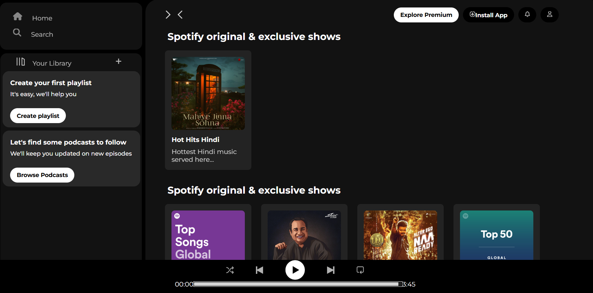

# Musically – Modern Music Player  

**Musically** is a sleek, fully responsive **music player web application** designed to provide an immersive and seamless audio streaming experience. Built using **HTML and CSS**, it features an elegant UI, dark theme, and intuitive controls for music playback.  

## Features  

- **Intuitive UI** – A modern and user-friendly interface for effortless navigation.  
- **Seamless Music Playback** – Play, pause, and control your favorite tracks with ease.  
- **Music Library & Playlists** – Organize and access your favorite songs in a structured manner.  
- **Dark-Themed Interface** – A visually appealing design optimized for long listening sessions.    
- **Fully Responsive Design** – Optimized for desktop, tablet, and mobile devices.  

## Technologies Used  

- **HTML5** – Structuring the web pages for a robust layout.  
- **CSS3** – Enhancing visual aesthetics with modern styling techniques.  

## Installation & Setup  

To run this project locally, follow these steps:  

1. **Clone the repository**  
   ```sh
   git clone https://github.com/yourusername/pantaloons.git
   ```
2. **Navigate to the project directory**  
   ```sh
   cd musically
   ```
3. **Open in Browser**  
   Simply open the `index.html` file in your web browser to view the project.

 ## Preview
   
 

